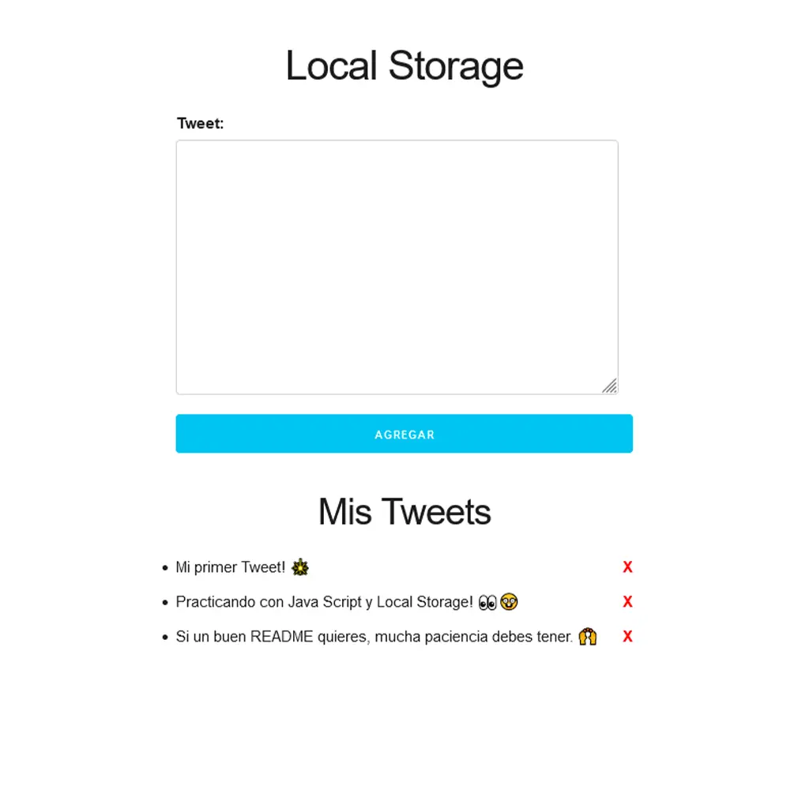

# To Do List Twitter 🐤

Pequeña aplicación web que permite crear, listar y eliminar publicaciones estilo "twits". Incluye validación de formulario y guarda los elementos en el almacenamiento local del navegador para persistencia entre recargas.

## Demo 📱

Ver la demo desplegada: [To Do List Twitter](https://jsproyecto4.netlify.app/)



## Características

- Validación de formulario: evita publicaciones vacías.
- Crear y eliminar publicaciones (twits).
- Listado de publicaciones en pantalla.
- Persistencia local: el listado se mantiene al recargar la página gracias a `localStorage`.

## Tecnologías utilizadas

- **JavaScript**: lógica de la aplicación y manipulación del DOM (`js/app.js`).
- **HTML**: estructura de la interfaz (`index.html`).
- **CSS**: estilos y diseño (`css/normalize.css`, `css/skeleton.css`, `css/custom.css`).

## Instalación y requisitos

Proyecto estático — no requiere servidor ni dependencias externas para ejecutarse.

### Requisitos mínimos:

- Navegador moderno (Chrome, Firefox, Safari).
- Node o Python opcional si quieres levantar un servidor local.

### Pasos rápidos:

1. Clona o descarga el repositorio.
2. Abre `index.html` directamente en el navegador, o sirve la carpeta con un servidor estático.

Comandos útiles (opcional):

```bash
# Servir con Python 3 (puerto 8000)
python3 -m http.server 8000

# O usa Live Server en VSCode para desarrollo en caliente
```

## Cómo funciona

- Al enviar el formulario, se intercepta el submit para evitar recarga.
- Se valida el campo de texto: se aplica `trim()` y se comprueba que no esté vacío.
- Si la validación pasa, se crea un objeto con el texto y un `id` único, se añade al arreglo de publicaciones y se guarda en `localStorage`.
- Se renderiza el listado actualizado en elDOM.
- Al pulsar el botón de eliminar en una publicación, se quita del arreglo, se actualiza `localStorage` y se vuelve a renderizar la lista.

### Validaciones

- Campo obligatorio: no se permiten publicaciones vacías ni solo espacios en blanco.
- (Opcional) Se podría añadir límite de longitud o filtrado de caracteres si se desea.

## Estructura de archivos

```bash
to-do-list-java-script/    # raíz del proyecto
├─ index.html              # HTML principal de la app
├─ README.md               # Documentación del proyecto (este archivo)
├─ LICENSE                 # Licencia MIT
├─ css/
│  ├─ normalize.css        # Reset/normalización de estilos
│  ├─ skeleton.css         # Grid y utilidades básicas (Skeleton)
│  └─ custom.css           # Estilos personalizados del proyecto
└─ js/
	└─ app.js               # Lógica de la aplicación (eventos, render, localStorage)
```

Cada archivo:

- `index.html`: Interfaz de usuario y formulario para crear publicaciones.
- `css/normalize.css`: Normaliza estilos entre navegadores.
- `css/skeleton.css`: Framework CSS ligero para layout.
- `css/custom.css`: Estilos y ajustes visuales del proyecto.
- `js/app.js`: Gestión de eventos, validaciones, renderizado y persistencia.
- `LICENSE`: Texto de la licencia MIT.
- `README.md`: Documentación del proyecto.

## Contribuciones

Si quieres mejorar este proyecto, sigue estos pasos:

1. Haz un fork del repositorio.
2. Crea una rama con tu mejora: `git checkout -b feat/mi-mejora`.
3. Haz tus cambios y commitea: `git commit -m "feat: descripción"`.
4. Abre un Pull Request describiendo los cambios.

Pequeñas mejoras sugeridas: agregar límite de longitud, mejorar accesibilidad, añadir tests o desplegar mediante CI/CD.

## Créditos

- **Juan Pablo De la Torre Valdez** - Instructor y autor del contenido del curso - [Codigo Con Juan](https://codigoconjuan.com/).
- **Mario Karajallo** - Implementación del proyecto y mantenimiento - [Mario Karajallo](https://karajallo.com).

## Licencia

Este proyecto está bajo MIT License. 
Consulta el archivo `LICENSE` para más detalles.

---

⌨️ con ❤️ por [Mario Karajallo](https://karajallo.com)
